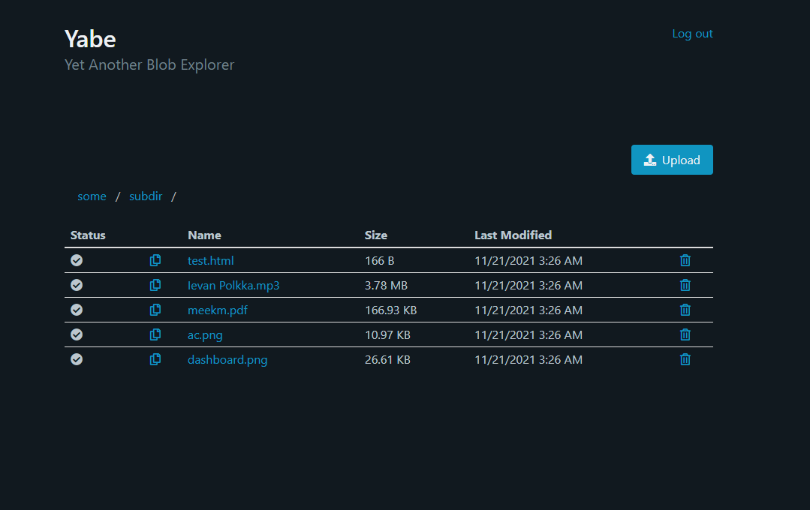

# The YABE project
Yet Another Blob Explorer. Browse, upload, and delete Azure Blob Storage blobs.


This project is a Blazor web app using the server hosting model. Authentication is provided by Azure AD.




### Azure Blob Storage
Navigate to your Storage Account in Azure Portal. Under the Access Keys tab find a value labeled "Connection string". Assign this value to `ConnectionStrings:AzureBlobStorage` the `appsettings.json` or by environment variable with prefix `Yabe_`. 

### Azure AD
Follow the instructions in [Register an application](https://docs.microsoft.com/en-us/azure/active-directory/develop/quickstart-register-app) with these additions:
* Select "Accounts in this organizational directory only" under Supported account types.
* Leave the Redirect URI drop down set to Web and enter https://your-domain/signin-oidc substituting your-domain with the domain you'll be hosting on.

Once your application is created navigate to Authentication -> Implicit grant and hybrid flows. Select ID tokens, and then select Save.

Copy your Application (client) ID and Directory (tenant) ID to the "AzureAD" settings in the `appsettings.json` file or environment variables. 


### Configuration:
Settings may be defined via the `appsettings.json` file or environment variables prefixed with `Yabe_`. Environment variables take precedence over the file. 

**Environment variable examples:**

* `Yabe_ConnectionStrings__AzureBlobStorage`
* `Yabe_Site__Title`

Note the double underscore separator `__` for nested settings.

**File appsettings.json:**

```json
  "ConnectionStrings": {
      "AzureBlobStorage": "your blob storage connection string"
  },
  "Yabe": {
      "Title": "Yabe",
      "SubTitle": "Yet Another Blob Explorer",
      "EditorRole": "Editor",
      "MaxUploadBytes": 15728640,
      "MaxFilesPerUpload": 10
  },
  "AzureAd": {
      "Instance": "https://login.microsoftonline.com/",
      "TenantId": "your ad app tenant id",
      "ClientId": "your ad app client (application) id",
      "CallbackPath": "/signin-oidc",
      "SignedOutCallbackPath": "/signout-oidc"
  }
```
