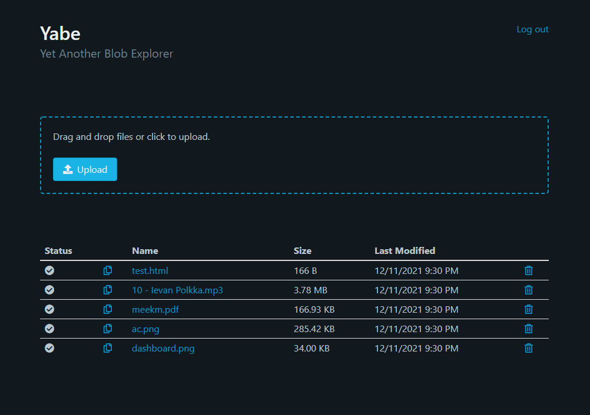

# The YABE project
Yet Another Blob Explorer. Browse, upload, and delete Azure Blob Storage blobs.


This project is a Blazor web app using the server hosting model. It began as a means for me to experiment with Blazor fundamentals. 



## Setup
### Configuration:
Settings may be defined via `appsettings.json`, `appsettings.secrets.json`, and environment variables prefixed with `Yabe_` in ascending order of precedence. 

**File appsettings.json:**

```json
"Site": {
    "Title": "Yabe",
    "SubTitle": "Yet Another Blob Explorer",
    "EditorRole": "Editor",
    "MaxUploadBytes": 15728640,
    "MaxFilesPerUpload": 10
},
"AzureAd": {
    "Instance": "https://login.microsoftonline.com/",
    "CallbackPath": "/signin-oidc",
    "SignedOutCallbackPath": "/signout-oidc"
}
```

**File appsettings.secrets.json:**
```json
"ConnectionStrings": {
    "AzureBlobStorage": "your blob storage connection string"
},
"AzureAd": {
    "TenantId": "your ad app tenant id",
    "ClientId": "your ad app client (application) id",
}
```
**Environment variable examples:**

* `Yabe_ConnectionStrings__AzureBlobStorage`
* `Yabe_Site__Title`

Note the double underscore separator `__` for nested settings.

### Azure Blob Storage:
Navigate to your Storage Account in Azure Portal. Under the Access Keys tab find a value labeled "Connection string". Fill in the `ConnectionStrings:AzureBlobStorage` setting with this value.

### Azure AD:
Follow the instructions in [Register an application](https://docs.microsoft.com/en-us/azure/active-directory/develop/quickstart-register-app) with these additions:
* Select "Accounts in this organizational directory only" under Supported account types.
* Leave the Redirect URI drop down set to Web and enter https://your-domain/signin-oidc substituting your-domain with the domain you'll be hosting on.

Once the application is created navigate to Authentication -> Implicit grant and hybrid flows. Select ID tokens, and then select Save. Next, add a role named "Editor" under the "App roles" tab. Assign the role to a user from the Enterprise applications section -> Users and groups. 

Add your Application (client) ID and Directory (tenant) ID to the "AzureAD" settings in the Yabe configuration. 

---
やべ！
